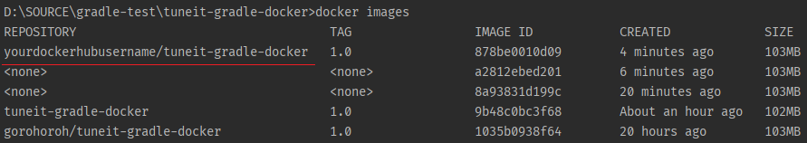
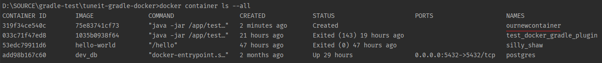
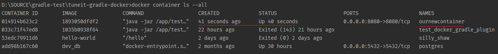
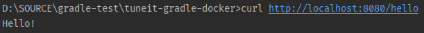

# Getting Started Building Docker Images with Gradle

This guide demonstrates how you can use Gradle and the [Gradle Docker plugin](https://github.com/bmuschko/gradle-docker-plugin) to define a Docker image, create a container based on that image, and run a containerized application locally.

We won't be creating a new Java application here: instead, we'll take a pre-made trivial Spring Boot application and containerize it.

## What you'll need
* About 20 (?) minutes
* A text editor or IDE
* A terminal application
* JDK 8 or later
* Docker Desktop for [Mac](https://docs.docker.com/docker-for-mac/install/) or [Windows](https://docs.docker.com/docker-for-windows/install/)

You do not need to install Gradle separately: the sample Spring Boot application that we'll use contains a Gradle wrapper that will discover and get a Gradle distribution automatically.

## Get a sample Java application
To get a sample Spring Boot application to containerize, [clone this repository](https://github.com/gorohoroh/tuneit-gradle-docker) from GitHub.

If cloning is not an option, [download the sample application](tuneit-gradle-docker-master.zip) in an archived form, and unpack the archive.

Open the sample application in your text editor or IDE of choice. At this point, the `build.gradle` file should look  like this:

```gradle
plugins {
    id 'java'
    id 'application'
    id 'org.springframework.boot' version '2.2.5.RELEASE'
}

repositories {
    mavenCentral()
}

dependencies {
    compile 'org.springframework.boot:spring-boot-starter-web:2.2.5.RELEASE'
}

application {
    mainClassName = 'com.tuneit.App'
}

jar {
    manifest {
        attributes 'Main-Class': 'com.tuneit.App'
    }

    from {
        configurations.compile.collect { it.isDirectory() ? it : zipTree(it) }
    }
}
```
 
## Apply the Gradle Docker plugin
Add the `docker-spring-boot-application` (or remote-api?) plugin to the `plugins` section of your build script file: 

```gradle
plugins {
    id 'java'
    id 'application'
    id 'org.springframework.boot' version '2.2.5.RELEASE'
    id 'com.bmuschko.docker-spring-boot-application' version '6.1.4'
}
```

## Import image and container types
As you will be using types from Gradle Docker plugin that we have just applied, add these import statements after the `plugins` section:

```gradle
import com.bmuschko.gradle.docker.tasks.image.*
import com.bmuschko.gradle.docker.tasks.container.*
```

## Create a task to generate a Dockerfile
In order for Docker to know how to configure your image, it needs a file called `Dockerfile`. Let's create a Gradle task that generates the file:

```gradle
task createDockerFile(type: Dockerfile) {
    from 'openjdk:8-jre-alpine'
    copyFile jar.archiveFileName.get(), '/app/test_service.jar'
    entryPoint 'java'
    defaultCommand '-jar', '/app/test_service.jar'
    exposePort 8080
}
```

When you execute this task, Gradle creates a `Dockerfile` under `build/docker`:

```dockerfile
FROM openjdk:8-jre-alpine
COPY tuneit-gradle-docker-1.0.jar /app/test_service.jar
ENTRYPOINT ["java"]
CMD ["-jar", "/app/test_service.jar"]
EXPOSE 8080
```

TODO elaborate on these instructions.

## Copy jar to docker build dir
When we build our Docker image, it will need to contain a JAR file with our application and all its dependencies. To make this file available, create a task that copies the assembled JAR file into `build/docker`:

```gradle
task syncJar(type: Copy) {
    dependsOn assemble
    from jar.destinationDirectory
    into "$buildDir/docker"
}

```

## Set Java compilation options to match base image specs
When we use our generated `Dockerfile` to build an image, it will be based on a distribution that uses JRE 8 as a runtime environment. In order to successfully run our application in this environment, let's make sure we generate Java classes compatible with Java 8:

```gradle
compileJava {
    sourceCompatibility = JavaVersion.VERSION_1_8
    targetCompatibility = JavaVersion.VERSION_1_8
}
``` 

## Build image
We are now ready to build our Docker image. To do this, add the following task:

```gradle
task buildImage(type: DockerBuildImage) {
    dependsOn createDockerFile, syncJar
    inputDir = createDockerFile.getDestDir()
    images = ["yourdockerhubusername/tuneit-gradle-docker:1.0"]
}
```

Make sure you have Docker running on your machine, and then execute the task:

```shell
❯ gradlew buildImage
```

This task will take outputs of the tasks we created earlier, and create a local Docker image. To verify that the image has been created, run the following Docker command:

```shell
❯ docker images
```

If all went well, you should see an entry describing the new image at the top of the list of available images:



## Create and start a container
Now that we have an image, we can create an actual container based on that image.

First, let's define the name for our container as a local variable: we'll need to use it from more than a single task. Near the top of the build file, just before the `repositories` extension, add this line:

```gradle
def ourContainerName = "ournewcontainer"
```

Now, if we start a container, and the container using the same name is already running, Docker will return an error.

Because of that, we should:
* Create task `stopContainer`;
* Create task `removeContainer` that depends on `stopContainer`;
* Create task `createContainer` that depends on `removeContainer`;
* Create task `startContainer` that depends on `createContainer`.

Tasks `stopContainer` and `removeContainer` will additionally need to suppress non-critical exceptions.

As a result, every time we want to start a container, Gradle will first make sure to:
* Check if a container using the same name is already running;
* If it is running, stop and remove the container.
* Create and run a new container.


Add the following tasks to the end of `build.gradle`:

```gradle
task stopContainer(type: DockerStopContainer) {
    targetContainerId("$ourContainerName")
    onError { exception -> handleError(exception) }
}

task removeContainer(type: DockerRemoveContainer) {
    dependsOn stopContainer
    targetContainerId("$ourContainerName")
    onError { exception -> handleError(exception) }
}

task createContainer(type: DockerCreateContainer) {
    dependsOn buildImage, removeContainer
    targetImageId buildImage.getImageId()
    containerName = "$ourContainerName"
    hostConfig.portBindings = ['8080:8080']
}

task startContainer(type: DockerStartContainer) {
    dependsOn createContainer
    targetContainerId("$ourContainerName")
}

private void handleError(Throwable exc) {
    if (exc.message != null && !exc.message.contains('NotModifiedException')) {
        throw new RuntimeException(exc)
    }
}
```

First, let's create a container and see if this works as expected:

```shell
❯ gradlew createContainer
```

To verify that a container has been created, run the following command in the terminal:

```shell
❯ docker container ls --all
```

You should see an entry describing the new container at the top of the list of available images:



Now, let's go all the way and start the container:

```shell
❯ gradlew startContainer
```

Did the container start? Let's find out:

```shell
❯ docker container ls --all
```

In the command output, you should see an entry indicating that the container has just been created, and is running:



Let's see if we can connect to our application running in the local container. Run the following command in the terminal:

```shell
❯ curl http://localhost:8080/hello
```

If the below is what you see in the output, then you are connected to the application running in a local Docker container!


